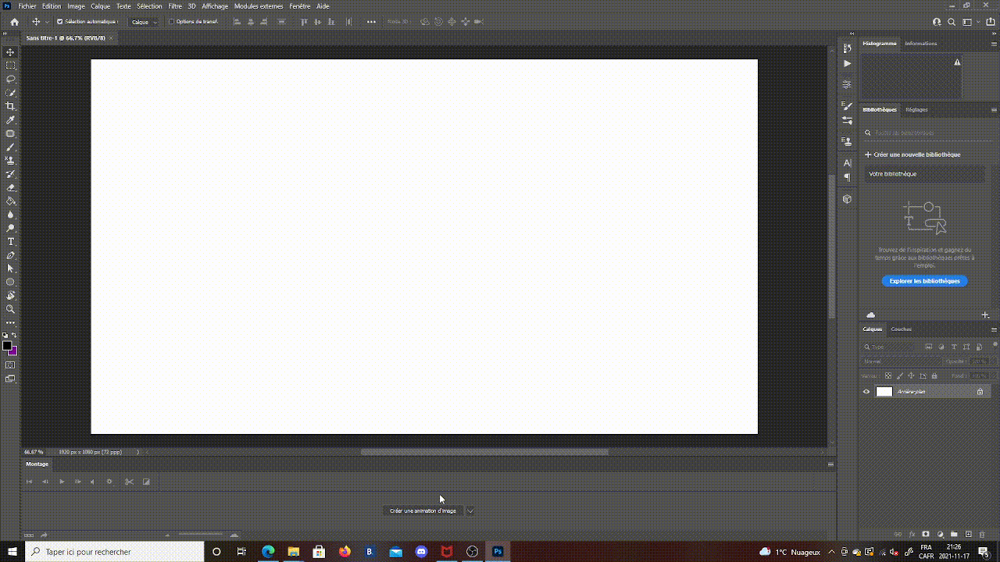
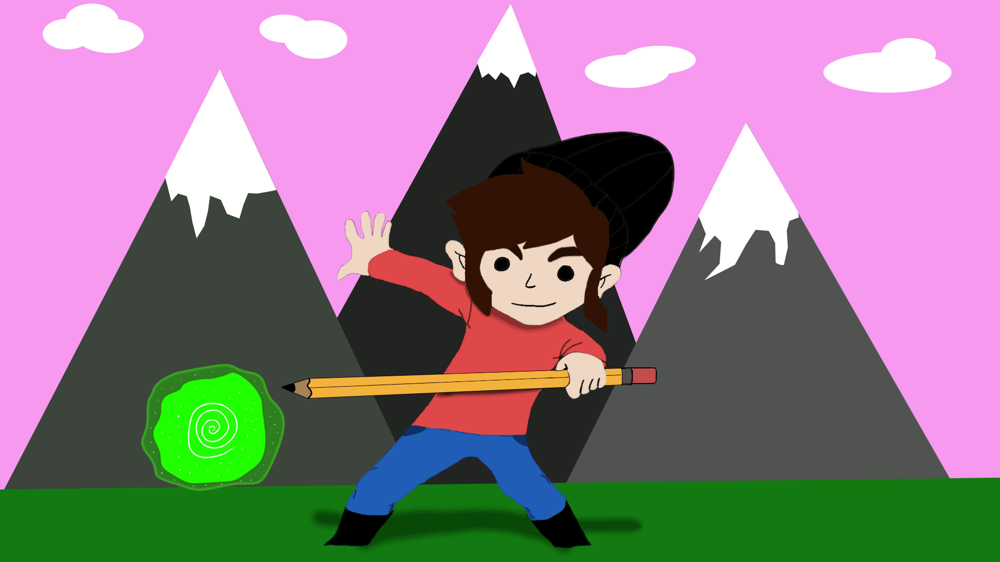
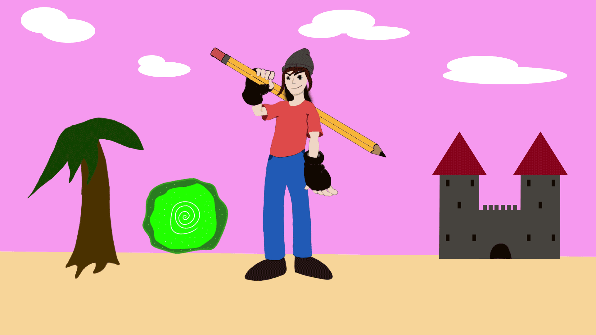
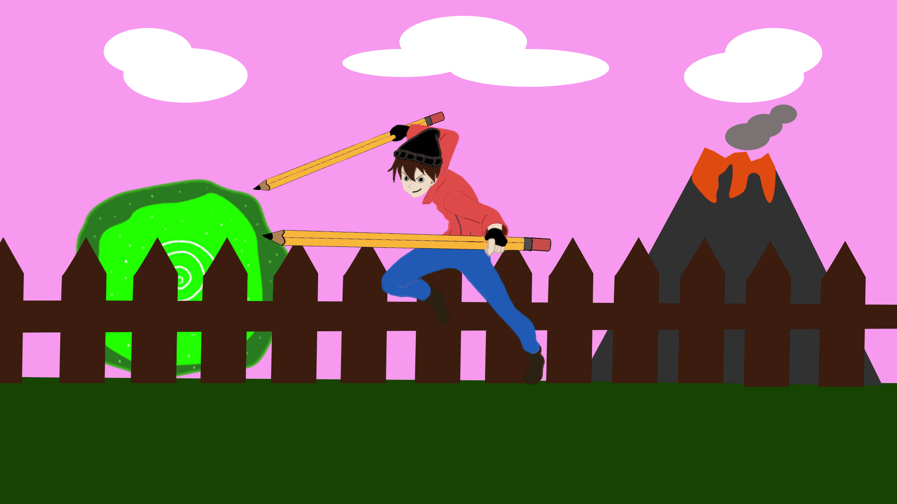
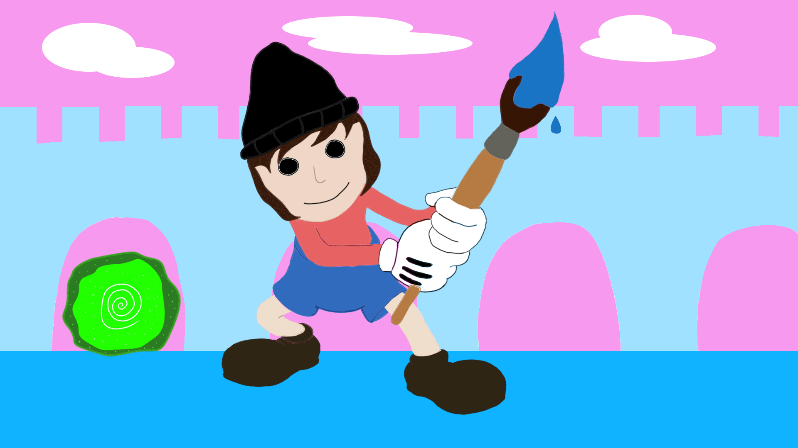
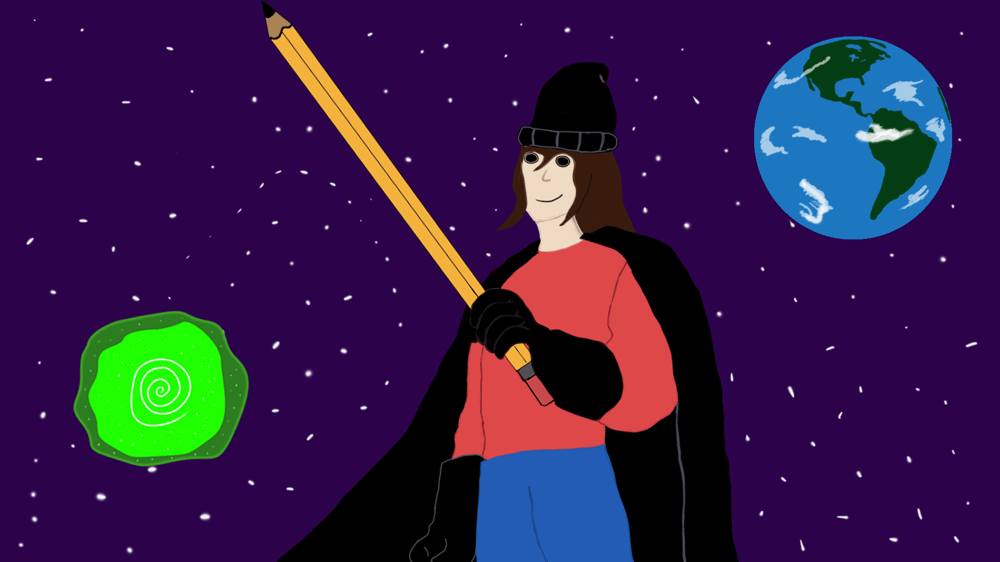
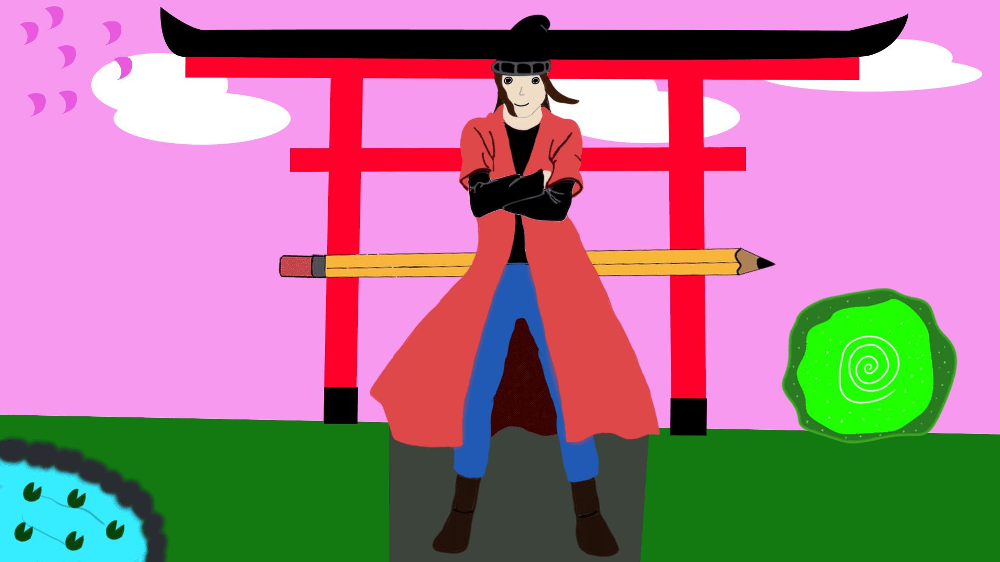
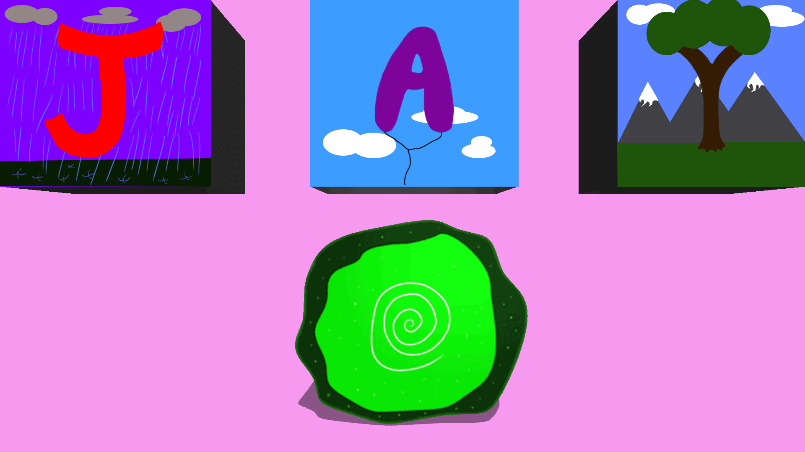
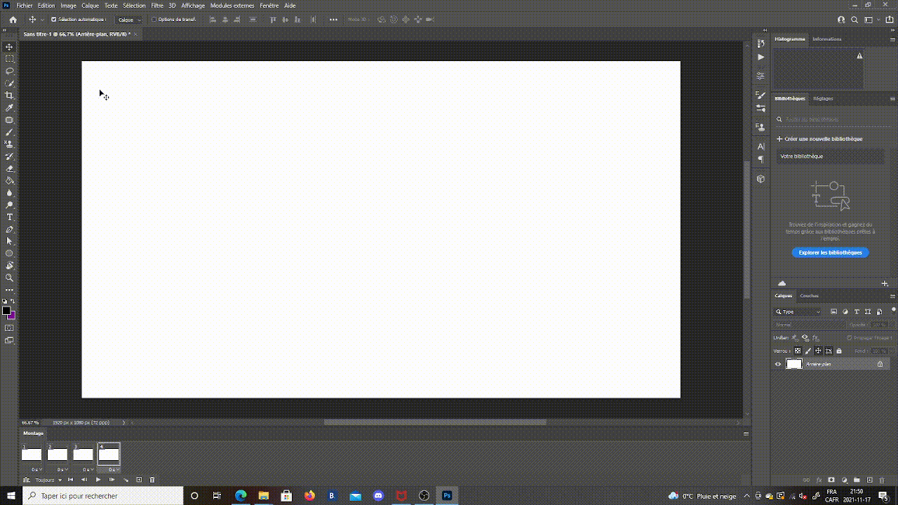
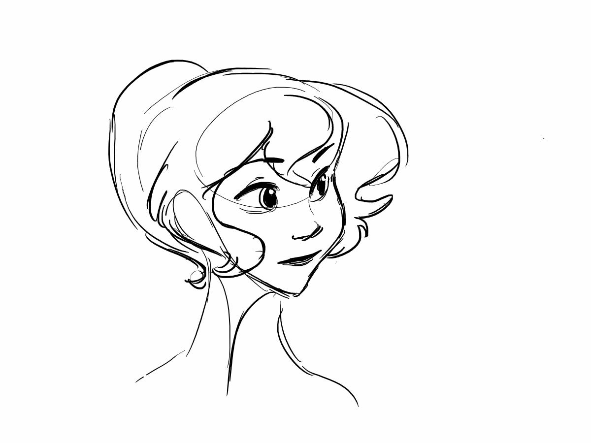

# Comment faire de l'animation sur photoshop

## Les étapes pour bien démarrer en animation

1. Démarrer photoshop
2. se créer un nouveau document 
3. Aller dans fenêtre 
4. Espace de travail
5. Sélectionner mouvement 

.gif)

## Comment créer une animation
1. Appuyer sur créer une animation d'image
2. Dessiner sur le calque
3. Ajouter un calque pour chaque élément à animer

### Exemple d'animation photoshop
Voici quelque exemples d'animation effectuer sur photoshop

### Pour faire une animation fluide
Pour pouvoir faire une animation fluide sur photoshop il faut utiliser beaucoup de calque. Cela veut donc dire qu'il va falloir consacrer beaucoup de temps à son animation pour la rendre la plus fluide possible. Je vous conseille de toujours sauvegarder après avoir créer un nouveau calque au cas où photoshop se fermerais à cause d'un bug ou autre pour ne pas perdre toute vôtre progression.

### Vous savez tout ce qu'il faut pour bien débuter en animation sur photoshop

La seule chose qu'il manque pour effectuer une animation sur photoshop c'est vous! Il faut beaucoup de patience lorsque l'on anime sur photoshop, mais une fois que l'ont travaillent sur un projet nous ne voyons plus le temps passer. L'animation est accessible à tout le monde, ce n'est donc pas très compliquer de s'en servir. 

